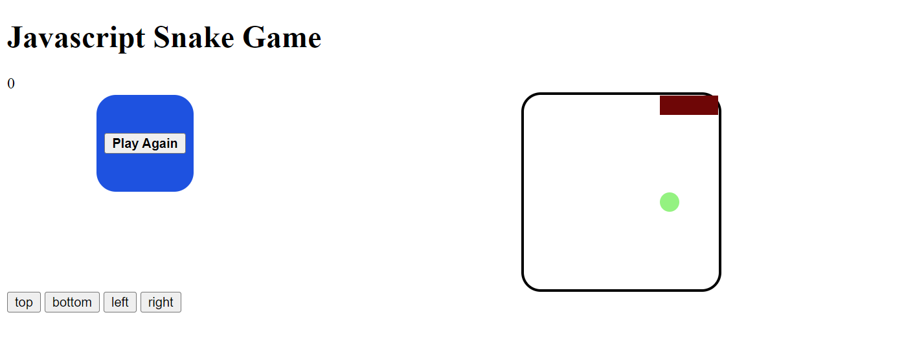

#Snake Game Using Javascript

A brief introduction of the game, the snake game is a simple game created using `HTML`, `CSS` and `Javascript`. The snake navigates the box trying to eat a fruit. Once the snake eats the fruit, the length of the snake increases and the pace becomes faster.
Then the game ends if the snake slide into any part of its body or part of the box.

HTML
For the HTML set up we have a `
` of class scoreDisplay thats serves the purpose of displaying the scores. Also a `
` with class box will be serve as the playground. The `
` class button will be used as the game control. The `
` with class popup will serve as the replay button.

CSS

The box which is the playground has `display: flex` and other set of dimensions. This will allow the container items to ne altered and set dimentsions to order the position. The `flex-wrap` property allows enabling the contol direction in which the lines are stacked. The purpose of the `CSS` is to style and layout the game

Javascript
The first thing we need to do is determine the variables

The variable width is the same as the width of the box. We make the snake and array call currentSnake

Will we use an eventListener on the object called `DomContentLoaded` and this is initiated as soon as the `HTML` content is loaded on our screen